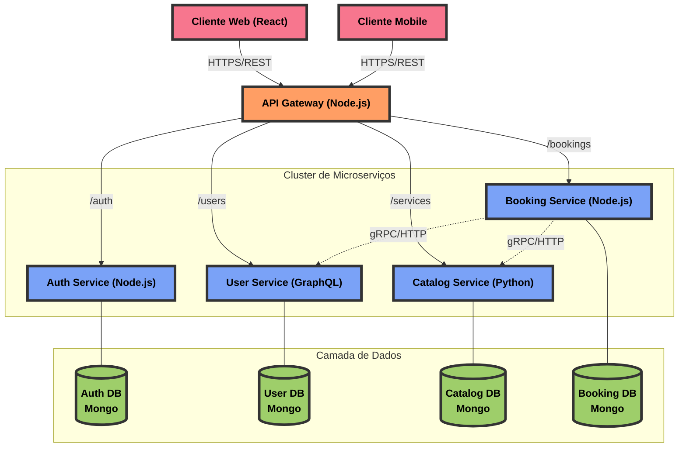

```mermaid
graph TD
    %% Estilos
    classDef gateway fill:#ff9e64,stroke:#333,stroke-width:4px,color:black,font-weight:bold;
    classDef service fill:#7aa2f7,stroke:#333,stroke-width:4px,color:black,font-weight:bold;
    classDef db fill:#9ece6a,stroke:#333,stroke-width:4px,color:black,font-weight:bold;
    classDef client fill:#f7768e,stroke:#333,stroke-width:4px,color:black,font-weight:bold;

    %% Nós
    ClientWeb["<b>Cliente Web (React)</b>"]
    ClientMob["<b>Cliente Mobile</b>"]
    
    Gateway["<b>API Gateway (Node.js)</b>"]
    
    subgraph "Cluster de Microserviços"
        Auth["<b>Auth Service (Node.js)</b>"]
        User["<b>User Service (GraphQL)</b>"]
        Catalog["<b>Catalog Service (Python)</b>"]
        Booking["<b>Booking Service (Node.js)</b>"]
    end
    
    subgraph "Camada de Dados"
        AuthDB[("<b>Auth DB\nMongo</b>")]
        UserDB[("<b>User DB\nMongo</b>")]
        CatalogDB[("<b>Catalog DB\nMongo</b>")]
        BookingDB[("<b>Booking DB\nMongo</b>")]
    end

    %% Relações Externas
    ClientWeb -->|HTTPS/REST| Gateway
    ClientMob -->|HTTPS/REST| Gateway

    %% Roteamento Gateway
    Gateway -->|/auth| Auth
    Gateway -->|/users| User
    Gateway -->|/services| Catalog
    Gateway -->|/bookings| Booking

    %% Comunicação Inter-serviços
    Booking -.->|gRPC/HTTP| User
    Booking -.->|gRPC/HTTP| Catalog

    %% Persistência
    Auth --- AuthDB
    User --- UserDB
    Catalog --- CatalogDB
    Booking --- BookingDB

    %% Aplicação de Estilos
    class ClientWeb,ClientMob client;
    class Gateway gateway;
    class Auth,User,Catalog,Booking service;
    class AuthDB,UserDB,CatalogDB,BookingDB db;
```
