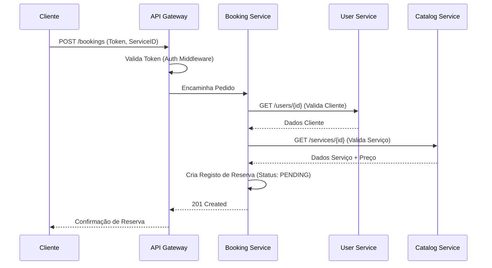

# Relatório de Projeto - Entrega 1
## Unidade Curricular: Computação na Cloud
**Data:** 28/11/2025
**Grupo:** (Inserir Nomes/Números)

---

## 1. Introdução e Contexto de Negócio

### A Visão: "ServiçosJá" - Plataforma Universal de Freelancers
O projeto consiste no desenvolvimento da **"ServiçosJá"**, uma plataforma inovadora de marketplace destinada a conectar clientes a profissionais de serviços, abrangendo tanto o domínio digital quanto o presencial.

Ao contrário das plataformas tradicionais focadas apenas em TI ou design, a "ServiçosJá" visa preencher uma lacuna no mercado de serviços físicos (construção, manutenção, limpeza, jardinagem), oferecendo a mesma facilidade de contratação que existe para serviços digitais.

---

## 2. Requisitos do Sistema

### Requisitos Funcionais
1.  **Gestão de Identidade:** Registo e autenticação de Clientes e Profissionais.
2.  **Catálogo de Serviços:** Pesquisa e visualização de serviços com filtros (preço, localização).
3.  **Gestão de Perfil:** Edição de dados, upload de portfólio e definição de disponibilidade.
4.  **Reservas (Booking):** Solicitação de serviço, aceitação/rejeição por parte do profissional e histórico de pedidos.
5.  **Avaliações:** Sistema de rating e comentários após a conclusão do serviço.

### Requisitos Não Funcionais (Quality Attributes)
1.  **High Availability (Alta Disponibilidade):** O sistema deve resistir a falhas de contentores individuais.
    *   *Estratégia:* Utilização de réplicas no Docker Compose (e futuramente Kubernetes) e políticas de `restart: on-failure`.
2.  **Scalability (Escalabilidade):** Capacidade de lidar com picos de carga.
    *   *Estratégia:* Arquitetura Stateless nos serviços Node.js/Python, permitindo escalar horizontalmente apenas os componentes sob carga (ex: escalar o *Booking Service* na Black Friday).
3.  **Reliability (Fiabilidade):** Garantia de consistência de dados.
    *   *Estratégia:* Uso de bases de dados independentes para isolamento de falhas e transações compensatórias (Saga Pattern) para operações distribuídas.
4.  **Observability (Observabilidade):** Capacidade de monitorizar o estado do sistema.
    *   *Estratégia:* Logs centralizados (stdout/stderr capturados pelo Docker) e Health Checks implementados em cada serviço.

---

## 3. Arquitetura e Design

### Justificação da Divisão em Microserviços
A escolha por microserviços em detrimento de um monólito deve-se a:
1.  **Domínios Bem Definidos:** O negócio separa-se claramente em Identidade, Catálogo e Reservas.
2.  **Escalabilidade Independente:** O serviço de Catálogo (muita leitura) tem requisitos diferentes do serviço de Reservas (muita escrita/transacional).
3.  **Flexibilidade Tecnológica:** Permite usar Python para análise de dados no Catálogo e Node.js para I/O no Gateway.

### Padrões de Microserviços Aplicados
1.  **API Gateway:** Ponto único de entrada que encapsula a arquitetura interna, gere autenticação e roteamento.
2.  **Database per Service:** Cada microserviço tem a sua própria base de dados (Postgres para Auth/Catalog, Mongo para User/Booking), garantindo desacoplamento total. Nenhum serviço acede à DB de outro.
3.  **Polyglot Persistence:** Uso da tecnologia de armazenamento mais adequada para cada tipo de dado (Relacional vs Documental).

### Diagrama de Arquitetura (Estrutura)

```mermaid
graph TD
    Client[Cliente (Web/Mobile)] -->|HTTP/REST| Gateway[API Gateway]
    
    subgraph "Microserviços"
        Gateway -->|HTTP/REST| Auth[Auth Service]
        Gateway -->|HTTP/REST| User[User Service]
        Gateway -->|HTTP/REST| Catalog[Catalog Service]
        Gateway -->|HTTP/REST| Booking[Booking Service]
        
        Booking -.->|HTTP| User
        Booking -.->|HTTP| Catalog
    end
    
    subgraph "Persistência de Dados"
        Auth -->|SQL| AuthDB[(Auth DB - Postgres)]
        User -->|NoSQL| UserDB[(User DB - Mongo)]
        Catalog -->|SQL| CatalogDB[(Catalog DB - Postgres)]
        Booking -->|NoSQL| BookingDB[(Booking DB - Mongo)]
    end
```

### Diagramas de Sequência (Operações Principais)

**1. Fluxo de Reserva de Serviço**


---

## 4. Implementação e Infraestrutura

A infraestrutura é totalmente baseada em **Docker**, garantindo consistência entre ambientes.

*   **Dockerfiles:** Otimizados (Multi-stage builds) para gerar imagens leves.
*   **Docker Compose:** Orquestra a rede interna `app-network` e gere volumes persistentes para garantir que os dados sobrevivem a reinícios.

---

## 6. Trabalho Futuro

Esta primeira entrega focou-se no estabelecimento da arquitetura e infraestrutura. As próximas fases de desenvolvimento incluirão:

1.  **Persistência de Dados:** Implementação dos conectores para PostgreSQL e MongoDB e criação dos esquemas de dados (Schemas/Models).
2.  **Lógica de Negócio:** Implementação das regras de validação, cálculo de preços e máquinas de estado.
3.  **Comunicação Inter-serviços:** Implementação efetiva das chamadas HTTP/gRPC entre o Booking, User e Catalog services.
4.  **Frontend:** Desenvolvimento da interface web para clientes e profissionais.

---

## 7. Análise Crítica e Conclusão

### Benefícios Experienciados (vs Monólito)
*   **Desenvolvimento Paralelo:** A equipa conseguiu trabalhar no *Catalog Service* e *User Service* simultaneamente sem conflitos de merge.
*   **Deploy Independente:** É possível atualizar o *Auth Service* sem reiniciar o sistema de Reservas.

### Desafios Encontrados
*   **Complexidade de Infraestrutura:** Configurar a rede Docker e garantir que os serviços se "veem" foi mais complexo do que num monólito.
*   **Consistência de Dados:** Garantir que uma reserva não é criada para um utilizador inexistente exigiu chamadas síncronas entre serviços, aumentando a latência.

### Utilização de AI (Inteligência Artificial)
Utilizámos assistentes de AI (como o Gemini/Antigravity) como "Pair Programmer" para:
1.  **Scaffolding Rápido:** Geração da estrutura de pastas e ficheiros base (`package.json`, `requirements.txt`) para múltiplos serviços em segundos.
2.  **Geração de Diagramas:** Criação automática do código Mermaid para a arquitetura e sequências, garantindo precisão visual.
3.  **Validação de Configuração:** Deteção de erros no `docker-compose.yml` (ex: portas duplicadas, dependências circulares).
*Justificação:* A AI permitiu focar no design da arquitetura e lógica de negócio, abstraindo a complexidade repetitiva do setup inicial.
